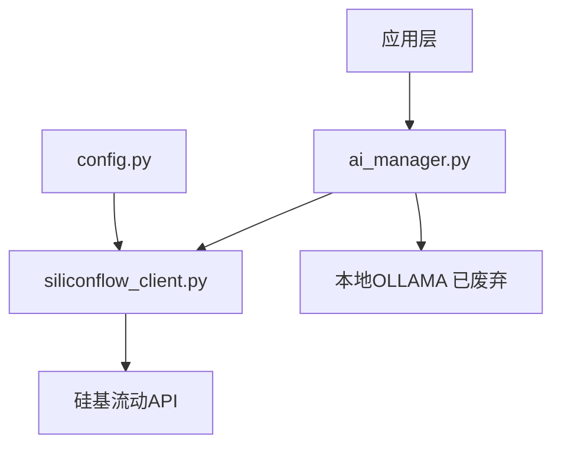
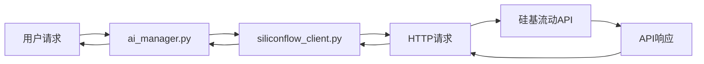

## Product Overview

硅基流动API集成实现计划，完成硅基流动API客户端的完整实现并集成到现有系统中，替代本地OLLAMA以提高推理速度和效果。

## Core Features

- 完整实现siliconflow_client.py客户端
- 确保与ai_manager.py的无缝集成
- 支持文本生成、聊天对话等核心AI功能
- 错误处理和重试机制
- 性能监控和日志记录

## Tech Stack

- **编程语言**: Python 3.8+
- **HTTP客户端**: requests/httpx
- **异步支持**: asyncio (可选)
- **配置管理**: config.py (已存在)
- **集成模块**: ai_manager.py (已存在部分集成)

## System Architecture

## Module Division

- **siliconflow_client.py**: 核心API客户端实现
- 文本生成接口
- 聊天对话接口
- 错误处理和重试逻辑
- 请求/响应数据模型
- **ai_manager.py**: AI管理器适配层
- 统一AI接口封装
- 客户端选择逻辑
- 响应格式标准化

## Data Flow

## Agent Extensions

### SubAgent

- **code-explorer** (from <subagent>)
- Purpose: 探索现有代码结构和文件内容，了解当前的实现状态
- Expected outcome: 获取完整的代码库结构，分析config.py和ai_manager.py的现有实现